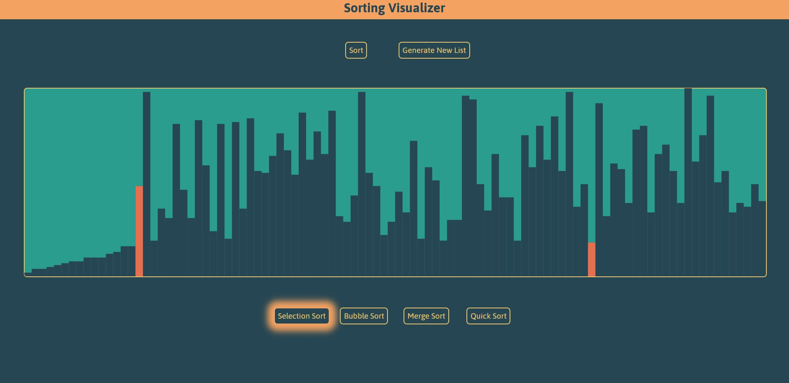
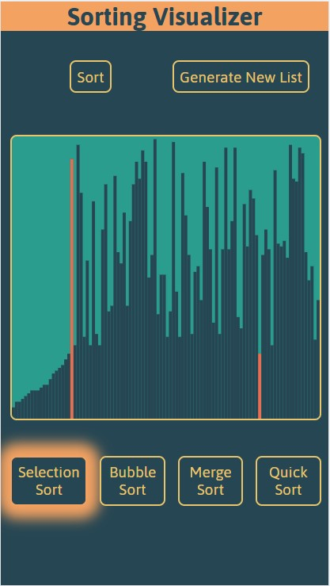

# Sorting Visualizer

This sorting visualizer is a graphical representation of popular sorting algorithms, showing each step as elements are swapped.

This is designed to look good on all screen sizes.

[View here](https://htrick.github.io/sorting-visualizer/)

## Screenshots

